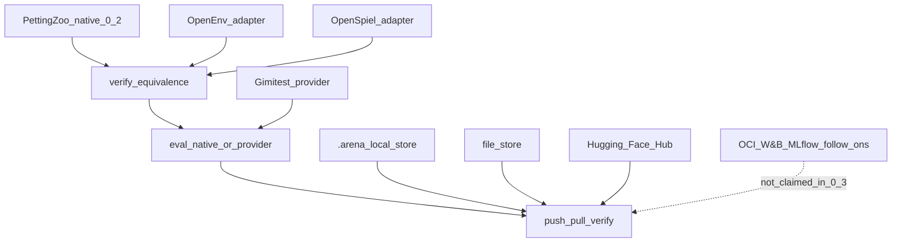

# Arena 0.3 delivery — Stage 2 external integrations

**Status:** Done (0.2 sealed as `v0.2.0`; 0.3 implemented)
**User promise:** Same policy/evaluation runs through native and external task runtimes with verified semantics; robustness testing and artifact mirroring plug in without changing the core artifact model.
**Roadmap source:** Product roadmap §7 (Release 0.3).
**Not in 0.3:** `arena train` / recipes (0.4), full dynamic-agent lifecycle ([RFC 005](../rfcs/005-dynamic-agents.md) parked).



---

## Locked defaults for 0.3

1. **Adapters only** — do not reimplement OpenEnv containers, Gimitest engines, or HF/OCI hosting.
2. **Local-first survives** — all core 0.2 flows work with external extras uninstalled (I-03).
3. **Identity unchanged** — push/pull never rewrites `sha256:…`.
4. **Equivalence before claim** — OpenEnv/OpenSpiel support claims require T-01 evidence.
5. **Order:** OpenEnv equivalence → OpenSpiel (narrow) → Gimitest provider → store adapters → U-03 usability.
6. **Dynamic agents:** still fail-loud unless a chosen 0.3 pilot *requires* RFC 005 (then a scoped spike, not a silent expansion).

---

## Specs (RFCs)

| RFC | Topic |
|-----|--------|
| [005](../rfcs/005-dynamic-agents.md) | Dynamic agents — **parked** |
| [006](../rfcs/006-openenv-task.md) | OpenEnv task adapter + equivalence |
| [007](../rfcs/007-openspiel-task.md) | OpenSpiel task adapter |
| [008](../rfcs/008-gimitest-provider.md) | Gimitest eval provider |
| [009](../rfcs/009-external-stores.md) | External artifact stores |
| [000](../rfcs/000-product-boundary.md) | Stage table |

### Acceptance gates (roadmap)

| ID | Gate |
|----|------|
| T-01 | Native ↔ OpenEnv/OpenSpiel trace equivalence (or declared tolerance) |
| T-02 | Serialization fidelity across transport |
| T-03 | Runtime failure semantics (disconnect/crash/timeout) |
| I-01 | Gimitest lineage complete |
| I-02 | Store push/pull digest round-trip |
| I-03 | Offline core without external adapters |
| S-01 | Overhead budget documented |
| U-03 | User adds one integration from docs + qualify template |

**Exit criterion:** Same policy/eval runs native + external task runtime with verified semantics; testing/storage tools attach without changing the artifact model.

---

## Executable phases

### Phase 0 — Seal 0.2 / branch hygiene (done when checklist green)

- [x] 0.2 demo + hermetic eval/U-01 green
- [x] RFCs 005–009 drafted; [0.2-complete.md](0.2-complete.md)
- [x] Tag / release note `v0.2.0`
- [x] Human eval sign-off remains optional and is explicitly not a release blocker
- [x] Open branch `release/0.3` from main after tag

### Phase 1 — Task packager + equivalence registry prep

**Goal:** Extension surface ready before OpenEnv code.

- [x] Document task-packager interface gaps for remote/env-server tasks
- [x] Add `eval_provider` registry (`native` default) mirroring metrics/samplers
- [x] CLI: `arena task import`, `arena task verify-equivalence`
- [x] Tests: unknown provider/packager → extension recipe

**Exit:** Registry + CLI surface exists; 0.2 suite still green.

### Phase 2 — OpenEnv adapter + equivalence (T-01…T-03)

**Goal:** First external task runtime.

- [x] Implement `openenv` task packager (RFC 006)
- [x] Freeze OpenEnv RPS twin in RFC 000
- [x] `arena task import openenv://…`
- [x] Trace-suite format + `verify-equivalence`
- [x] Failure recording for disconnect/crash/timeout/protocol errors
- [x] Qualify fixture + docs
- [x] Extra: `arena[openenv]` optional dependency

**Exit:** T-01 green on pilot; I-03 still holds with extra uninstalled.

### Phase 3 — OpenSpiel narrow adapter (OS-*)

**Goal:** One small game, not the whole catalog.

- [x] Freeze `tic_tac_toe` in RFC 007
- [x] `openspiel` packager + match/eval path
- [x] Reference-trace suite
- [x] Qualify + `arena[openspiel]` extra

**Exit:** OS exit evidence; no claim beyond the frozen game.

### Phase 4 — Gimitest provider (GI-* / I-01)

**Goal:** Robustness eval without breaking native eval.

- [x] `provider: gimitest` on evaluation manifests
- [x] Content-address provider_config; lineage on eval-run/report/cells
- [x] Example `examples/eval/robustness.yaml`
- [x] Qualify + docs; native default unchanged

**Exit:** I-01 green; native cross-play demo still one command.

### Phase 5 — Store adapters (ST-* / I-02)

**Goal:** Mirror bytes, don’t host a service.

- [x] Store adapter registry + `file://` reference implementation first
- [x] Hugging Face Hub network adapter selected after file
- [x] `arena push --verify` / `arena pull --verify`
- [x] Byte-identical round-trip and mutation-rejection acceptance tests
- [x] OCI/W&B/MLflow explicitly scoped as follow-ons, not partial claims

**Exit:** I-02 on at least `file://` + one network backend; offline core intact.

### Phase 6 — Budgets, usability, ship (S-01 / U-03)

- [x] Measure adapter overhead; document unsuitable fast-step workloads (S-01)
- [x] Adapter author template + U-03 checklist
- [x] Update README capability matrix; RFC 000 → **0.3 Done**
- [x] Offline-core/hermetic gates cover optional integration isolation
- [x] Tag `v0.3.0` after release verification

**Exit:** Roadmap §7.5 exit criterion met; `pytest -q` + slow gates green.

---

## Suggested CLI surface (0.3)

```bash
arena task import openenv://… --name task:…
arena task verify-equivalence task:native@… task:openenv@… --trace-suite …
arena eval run eval.yaml --provider native|gimitest
arena push policy:… hf://…|oci://…|file://…
arena pull hf://… --verify
```

## Non-goals (enforce)

- No `arena train` in 0.3 (that is 0.4).
- No Arena-hosted registry/auth.
- No silent Elo.
- No “all OpenSpiel games supported.”
- No dynamic agents unless RFC 005 revived with a named env.

## Risk controls

- Ship OpenEnv equivalence before Gimitest/stores.
- Keep PettingZoo path default; extras opt-in.
- Every new packager/provider/store kind goes through registry + qualify.
- If OpenEnv upstream is broken for the pilot, **document and narrow** the pilot—do not block forever or fake T-01.
